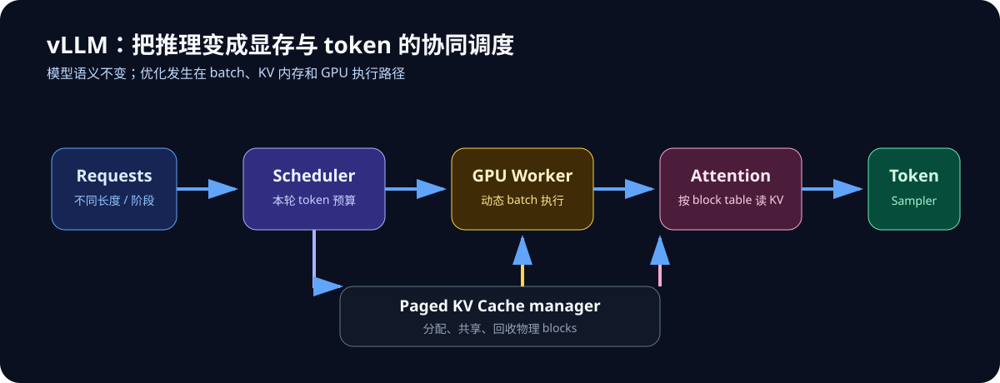

# vLLM T4 Lab

可复现的 vLLM 推理实验：以 Kaggle 的 NVIDIA T4 GPU 为实验环境，重点理解
PagedAttention、KV Cache、连续批处理和吞吐量测量。

> 这不是训练仓库。vLLM 是推理与服务引擎；这里的“实验脚本”用于启动、验证和压测推理服务。



## 已验证基线

| 项目 | 结果 |
| --- | --- |
| GPU | NVIDIA T4 × 1（T4 × 2 环境中的单卡基线） |
| 模型 | `Qwen/Qwen2.5-1.5B-Instruct` |
| vLLM | `0.18.0` |
| Attention 后端 | `TRITON_ATTN` |
| KV Cache | 6.69 GiB / 250,624 tokens |
| 短生成观测 | 约 16.43 output tok/s |

完整边界与实验条件见 [reports/2026-09-25-single-t4-baseline.md](reports/2026-09-25-single-t4-baseline.md)。

### 最新：T4 × 2 离线 TP 基线（已完成）

在同一 Kaggle T4 × 2 会话、`Qwen/Qwen2.5-1.5B-Instruct`、`vllm==0.18.0`、FP16、
`TRITON_ATTN`、`max_model_len=2048`、`gpu_memory_utilization=0.80` 下，TP=2 在固定 batch
decode 工作点均快于 TP=1：

| batch | TP=1 output tok/s | TP=2 output tok/s | TP=2 / TP=1 |
| ---: | ---: | ---: | ---: |
| 1 | 68.084 | 117.291 | 1.723× |
| 4 | 260.912 | 420.756 | 1.613× |
| 8 | 495.084 | 805.488 | 1.627× |
| 16 | 948.685 | **1,283.935** | **1.353×** |

这证明该离线工作负载上 TP=2 有收益；它**不**代表在线服务 QPS、TTFT、TPOT 或 P95。
可复核口径、环境和聚合结果见 [双 T4 报告](reports/2026-09-27-kaggle-t4x2-batch-matrix.md)，
当前阶段及未完成项见 [实验状态](reports/2026-09-27-experiment-status.md)。

## 仓库结构

```text
docs/       原理、兼容性说明与压测方法
reports/    已完成实验的可解释结果
scripts/    最小推理、服务启动、压测命令
papers/     外部论文、阅读笔记与自主技术写作
```

## 快速开始（Kaggle T4）

1. 在 Kaggle Notebook 设置中启用 GPU，并在首次安装时启用 Internet。
2. 安装与实验匹配的依赖：`pip install -r requirements-t4.txt`。
3. 运行 `python scripts/run_minimal_t4.py`。
4. 观察启动日志中的 GPU、attention 后端、KV Cache 容量和生成结果。

T4（compute capability 7.5）不应假定支持 FlashAttention-2。本仓库的
`TRITON_ATTN` 是本次 Kaggle + vLLM 0.18.0 的已验证配置，迁移到其他 GPU 或
vLLM 版本前应先重新测量。

## 学习路线

1. 先跑通最小脚本，确认模型与 KV Cache 可用。
2. 阅读 [docs/vllm-principles.md](docs/vllm-principles.md)，理解调度器为何需要
   PagedAttention 与连续批处理。
3. 用 [scripts/serve_t4.sh](scripts/serve_t4.sh) 启动 OpenAI 兼容服务。
4. 按 [docs/benchmark-plan.md](docs/benchmark-plan.md) 做 1 / 4 / 16 / 32 并发对照。

## 实验状态与下一步

[`scripts/benchmark_t4_batch_matrix.py`](scripts/benchmark_t4_batch_matrix.py) 的 T4 × 2 固定
batch 对照已经完成并归档。当前下一项不是重复这组离线结果，而是用公开 ShareGPT 临时工作负载
运行 TP=1/TP=2、并发 1/4/16 的在线服务矩阵，记录 TTFT、TPOT、P95、aggregate output tok/s
和同时间窗 GPU 指标。原始对话、提示词和回复不进入仓库。

最近的 Kaggle 保存版本被取消，因而没有新结果；已完成基线不受影响。对应的私有 Kaggle
内核：[vLLM T4 batch matrix and tensor-parallel study](https://www.kaggle.com/code/placideo/vllm-t4-batch-matrix-and-tensor-parallel-study)。

## 实验纪律

- 固定模型、prompt 集合、`max_tokens` 与随机参数。
- 先 warm-up，再记录 TTFT、P50/P95、总 output tok/s 与 KV 使用情况。
- 单请求 token/s 不是 vLLM 的核心胜负手；混合长度、多并发请求下的持续吞吐才是。

完整的模块设计图、原理边界与指标关系见 [docs/vllm-system-design.md](docs/vllm-system-design.md)。
仓库文档、图、代码与实验产物的完整映射见 [docs/artifact-index.md](docs/artifact-index.md)。
