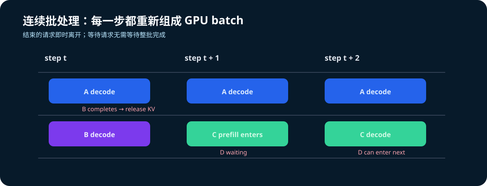
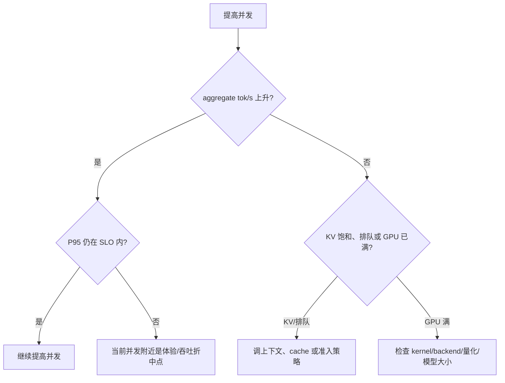

# T4 并发压测计划

目的不是得到一个脱离上下文的“最大 tok/s”，而是找到在给定模型、上下文和 SLO 下的
可解释工作点。

## 控制变量

```text
模型：Qwen/Qwen2.5-1.5B-Instruct
GPU：T4 × 1（第二阶段再做 T4 × 2 / TP=2）
vLLM：0.18.0
max_model_len：2048
gpu_memory_utilization：0.70
prompt 集合：公开 ShareGPT；固定 seed 后按 tokenizer 分为短/中/长三档
输出上限：固定 max_tokens
采样：temperature=0 或固定 seed
```

完整数据来源、筛选约束与证据字段见 [public-workloads.md](public-workloads.md)。先启动服务：

```bash
bash scripts/serve_t4.sh
```

然后以同一客户端、同一公开 request 集合，按并发梯度跑完每组。每组先 warm-up，再记录
正式样本。初始正式样本量为每工作点 100 requests；所有工作点复用相同 dataset hash 和 seed。

在 Kaggle 中启动服务后，每个并发点使用同一 wrapper：

```bash
TP=1 GPU_MEMORY_UTILIZATION=0.70 MAX_MODEL_LEN=2048 \
bash scripts/serve_t4.sh > /kaggle/working/vllm_t4_results/server-tp1.log 2>&1 &

GPU_METRICS_OUTPUT=/kaggle/working/vllm_t4_results/gpu-tp1-c16.csv \
INTERVAL_SECONDS=1 DURATION_SECONDS=300 \
bash scripts/collect_gpu_metrics.sh &

MAX_CONCURRENCY=16 \
BENCHMARK_OUTPUT_DIR=/kaggle/working/vllm_t4_results/online_sharegpt \
bash scripts/run_public_sharegpt_serve_benchmark.sh
```

脚本会从公开 ShareGPT URL 临时下载数据、写入数据 SHA-256 到结果 metadata，并在退出时删除
原始 JSON；它不启用 `--save-detailed`，以免把原始对话或模型回复复制进实验产物。
GPU CSV 是与该工作点同时间窗的硬件证据；TP、KV 配置、backend 和 server startup log 必须一起保存。

| 阶段 | 并发 | 要回答的问题 |
| --- | ---: | --- |
| A | 1 | 可用性与单请求参考延迟是什么？ |
| B | 4 | 连续批处理开始带来多少 aggregate throughput？ |
| C | 16 | 吞吐增长是否仍快于尾延迟恶化？ |
| D | 32 | 是否触及 KV / 排队 / 调度饱和点？ |
| E | TP=2 对照 | 更多显存是否抵过 T4 PCIe 通信成本？ |



## 每组必记指标

| 指标 | 为什么重要 |
| --- | --- |
| 请求数、成功数、错误数 | 首先证明结果可用。 |
| TTFT P50 / P95 | 衡量 prefill + 排队体验。 |
| 总完成时间 P50 / P95 | 观察尾延迟与请求间干扰。 |
| aggregate output tok/s | vLLM 在并发下的关键产出指标。 |
| 每请求 output tok/s | 辅助观察 decode 速度是否被拥塞牺牲。 |
| GPU 利用率、显存与 KV 指标 | 将“快/慢”归因到计算、带宽或内存容量。 |
| 启动日志的 backend / KV 容量 | 防止不同配置被误当成可比较样本。 |

## 结果记录模板

```markdown
### Run: T4-1G-16C-YYYYMMDD

- model / vLLM / backend:
- GPU / TP:
- prompt length distribution:
- max_tokens / sampling:
- warm-up requests:
- measured requests / concurrency:
- TTFT P50 / P95:
- completion P50 / P95:
- aggregate output tok/s:
- errors / preemptions:
- KV Cache capacity / observed pressure:
- interpretation: 该点的瓶颈是什么？下一次只改哪个变量？
```

## 判读规则



若 TP=2 的吞吐没有提升，不应立刻判为配置错误：对 1.5B 小模型，层间 collective 的 PCIe
通信可能超过拆分计算节省的时间。要用启动日志、GPU 利用率与 per-token 延迟一起判断。
