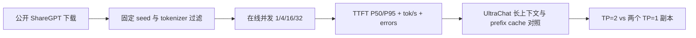

# 公开数据集 workload 协议

本实验室只使用公开可访问的模型和数据集。原始 prompts、对话文本和模型权重均不提交到
仓库；Kaggle 运行时下载数据，仓库只保存来源、筛选规则、seed、配置、聚合统计与结果 JSON。

## 主 workload：ShareGPT

vLLM 的公开 benchmark 文档列出 ShareGPT 为 online 与 offline 基准均支持的数据集，并给出
以下公开下载位置：

```text
https://huggingface.co/datasets/anon8231489123/ShareGPT_Vicuna_unfiltered/resolve/main/ShareGPT_V3_unfiltered_cleaned_split.json
```

这使我们的在线实验能够直接对齐 vLLM 的 `sharegpt` loader，而不是发明一个只适用于本仓库
的 prompt 集合。

### 固定抽样协议

| 字段 | 约束 |
| --- | --- |
| 数据来源 | 上述公开 ShareGPT JSON URL |
| 下载位置 | Kaggle 临时目录；不作为 kernel output 或 Git 文件上传 |
| seed | `20260927` |
| 会话过滤 | 至少一条 human → assistant 轮次；输入取最后一个 assistant 回复之前的上下文 |
| 上下文上限 | 以模型 tokenizer 计数，预留输出长度后不超过 `max_model_len` |
| 输出上限 | `max_tokens=64`，`temperature=0` |
| online 样本量 | 正式实验每个工作点 100 requests；warm-up 10 requests |
| 长度分层 | short / medium / long 三档；边界由实际 token 统计随结果一同保存 |

> “公开可访问”不等于可以重新发布原始内容。因此仓库不会镜像、拼接或展示任何原始对话；
> 报告只输出长度直方图、seed、request id 哈希和聚合指标。

## 补充 workload：UltraChat 200k

[HuggingFaceH4/ultrachat_200k](https://huggingface.co/datasets/HuggingFaceH4/ultrachat_200k)
提供公开的多轮 `messages` 字段，适合研究对话历史、长 prefill 和 prefix reuse。它不是主基准的
替代品：只有当 ShareGPT 的固定并发曲线完成后，才用同一模型/服务配置比较长上下文和共享前缀。

## 运行顺序



## 证据要求

每次记录均必须包含：dataset URL、下载文件 SHA-256、vLLM/模型/tokenizer revision、seed、
筛选数量、输入/输出 token 分布、请求到达模型、服务端配置和原始 benchmark JSON。任何一项
缺失时，该次结果只能作为调试记录，不能进入性能结论。
