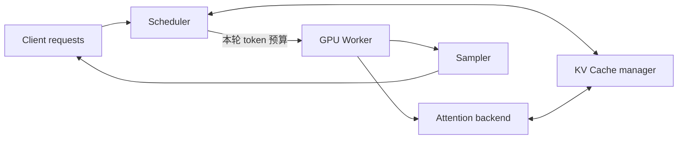
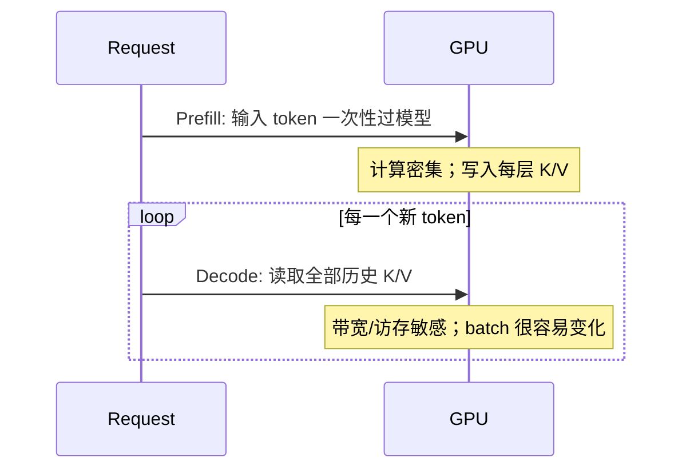
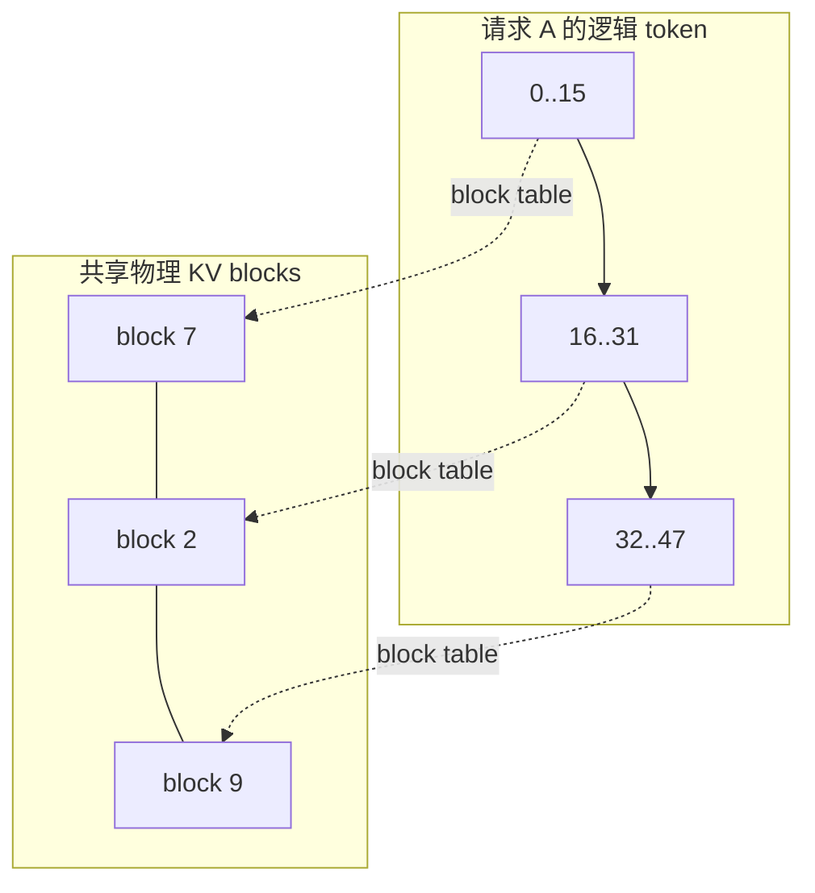
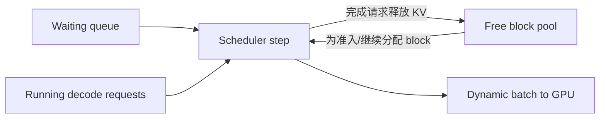

# vLLM 原理：把 Transformer 推理变成资源调度问题

vLLM 没有改变 Transformer 的数学语义；它优化的是服务端如何让**不同长度、不同阶段**的请求共享 GPU 时间和显存。

核心分工是：Scheduler 决定“谁前进一步”，KV manager 决定“历史放哪里”，
attention backend 决定“怎样读历史”，Worker 负责“怎样算这一轮”，Sampler 决定“下一 token”。

## 1. Prefill 与 Decode：两种完全不同的负载

- **Prefill** 处理 prompt，通常算力密度高，目标是降低 TTFT。
- **Decode** 每一步只加一个 token，却要访问长历史的 K/V；服务吞吐更容易被显存带宽、批调度和 KV 容量限制。
- 因此“单请求生成速度”不能代表线上表现；混合 prefill/decode 的调度更关键。

## 2. PagedAttention：KV Cache 的虚拟内存思想

朴素实现会为每个请求预留一块连续、按最大长度估计的 KV 空间。请求长短不一时，
已分配而未使用的尾部造成严重内部碎片。

它把 KV 按固定大小切成 blocks：

1. 请求增长时只申请下一个 block，而不是移动或扩容整段连续内存。
2. 每个序列维护 block table，把逻辑位置翻译到物理 block。
3. Attention kernel 依据 block table 做 gather 式访问，因此不同请求不要求同长度或同一连续地址。
4. 请求完成后 blocks 归还空闲池；prefix caching 时可通过引用计数共享前缀 blocks。

代价是块表查找、非连续访存与最后一个 block 的少量浪费；收益是大幅降低内部碎片，
让更多活跃序列留在同一张卡上。

## 3. 连续批处理：每个调度步都重组 batch

传统静态 batch 要等整批都结束，短请求会被长请求拖住。vLLM 在每轮调度中重估可用
token 预算：结束的请求立刻退出，等待队列中的请求可立即进入。

调度器要同时权衡：

- decode 继续推进，避免已在服务中的请求饥饿；
- 新 prompt 的 prefill，控制 TTFT；
- 当前可用 KV blocks 和最大 batched tokens；
- 公平性、优先级与长请求的抢占/换出策略。

这也是 vLLM 的“高吞吐”来源：不是让单个 token 的数学更快，而是减少 GPU 等待、KV 浪费和
静态 batch 的空洞。

## 4. Attention backend 与图执行

同样的 attention 公式会因 kernel 的融合程度、访存模式和 GPU 架构而有明显差异。

| 机制 | 做什么 | 对 T4 的启示 |
| --- | --- | --- |
| Paged attention kernel | 按 block table 读取 K/V | 后端必须支持 paged KV 访问。 |
| FlashAttention 系列 | 分块计算，避免显式 materialize 大 attention 矩阵 | 不同 GPU/版本支持差异大；T4 不应默认走 FA2。 |
| CUDA Graph | 固化常见执行图，减少 launch 开销 | 输入形状频繁变化时收益会受限；首轮可用 eager 排障。 |
| kernel fusion | 减少中间张量与读写 | 对 decode 这类小步循环常常很重要。 |

本实验对 Kaggle T4 显式选择 `TRITON_ATTN`。这是一项**环境结论**，而不是通用配方。

## 5. 进一步的工程能力

| 能力 | 底层原理 | 主要收益/代价 |
| --- | --- | --- |
| Prefix caching | 多请求共享相同前缀对应的 blocks | 少做 prefill、少占 KV；需要精确的引用计数与失效管理。 |
| Chunked prefill | 把超长 prompt 切成 token chunks 与 decode 交错 | 缓解长 prompt 独占 GPU；调度更复杂。 |
| Tensor parallel | 每层权重与计算切到多卡，再用 collective 通信合并 | 扩大可服务模型；小模型在 PCIe T4 上可能被通信抵消。 |
| Quantization | 权重/KV 用更低比特表达 | 降显存和带宽；需权衡质量、校准与 kernel 支持。 |
| Speculative decoding | draft 模型先提议多 token，target 模型并行验证 | 目标模型步数下降；收益取决于接受率。 |
| Structured output | grammar/FSM 屏蔽不合法 token | 输出稳定；logits 处理和状态机有额外开销。 |

## 6. 量什么，才知道优化是否成立

- **TTFT**：用户何时看到第一个 token；prefill 与排队直接影响它。
- **ITL / TPOT**：相邻 token 的时间；decode kernel 与拥塞影响它。
- **P50/P95/P99 延迟**：不要只看平均值，尾延迟往往揭示调度或 KV 压力。
- **aggregate output tok/s**：多并发下服务实际完成的 token 总速率。
- **KV Cache 利用率、排队长度、抢占/换出次数**：解释吞吐变化的因果指标。

对 T4×2，建议先 TP=1 做并发曲线；再以 TP=2 做对照。若小模型 TP=2 更慢，
这不是失败，而是一次看见“更多显存”和“更多 PCIe 通信”之间张力的实验。
