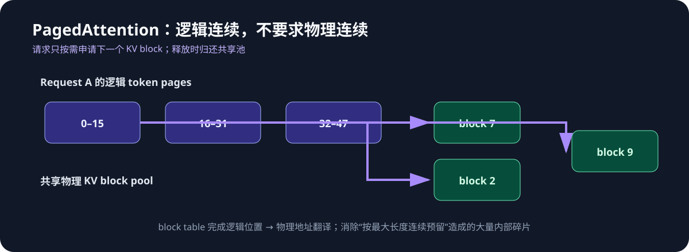
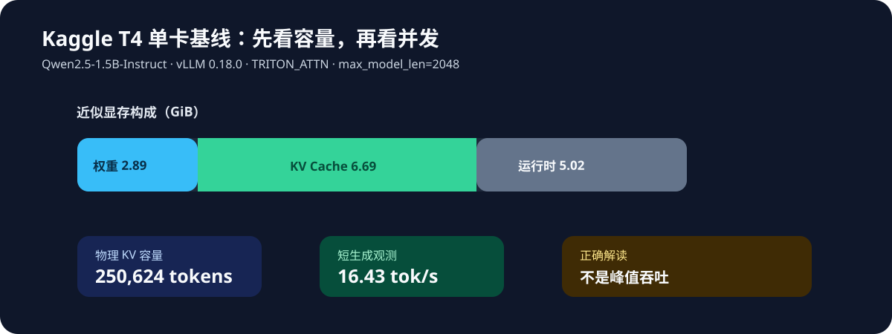

# vLLM 系统设计：模块、数据结构与性能因果链

这份文档是本仓库的自有 Markdown 设计说明。它把“vLLM 有什么能力”和“每项能力在内部
怎样工作”连起来；结论以本仓库的 T4 实验和可复现脚本为边界。


## 1. 一次请求如何流动

1. API 层把 prompt、采样参数、优先级和停止条件变成 request state。
2. Scheduler 在每个调度步决定 prefill 和 decode 各占多少 token 预算，并检查 KV block 是否足够。
3. KV manager 为增长中的序列分配/共享/回收 blocks，向 worker 提供 block tables。
4. Worker 用本轮的 token、位置、block tables 和采样 metadata 调用模型与 attention backend。
5. Sampler 从 logits 选出下一 token；已完成请求释放 blocks，等待请求可以立即加入下一轮。

这五层分离的意义是：改调度策略、内存组织或 kernel 时，不需要改变模型生成的语义。

## 2. Paged KV allocation：最关键的数据结构

每层每个 token 都会产生 key/value。连续为每条序列预留“最大长度”的做法会在长度不均时
产生大量内部碎片。vLLM 将 KV 切成固定大小的物理 blocks，并维护逻辑页到物理 block 的表。



**分配过程**：序列写到当前 block 的末尾时，KV manager 从 free pool 取一个新 block，并把
其 ID 追加到 sequence 的 block table。请求结束后，块回到 free pool；共享前缀时，多个请求
可指向相同 blocks，并通过引用计数决定何时可回收。

**为什么不只是内存优化**：KV 变成可按需分配后，调度器才能在同一批中容纳不同上下文长度的
请求；这直接决定并发上限、排队时间和每轮可推进的 decode 数量。

## 3. Continuous batching：调度器怎样避免静态 batch 空洞


静态 batch 的问题是最短请求完成后仍占着队列位置。连续批处理在每一个 engine step 都更新状态：

- 完成请求离开并归还 KV blocks；
- running decode 请求继续各生成一个 token；
- scheduler 按 token budget 让 waiting prefill 请求进入；
- worker 执行由不同长度、不同阶段请求拼出的动态 batch。

性能收益来自更高的 GPU 利用率和更低的空洞时间；代价是调度器必须同时处理公平性、TTFT、
尾延迟、KV 紧张和长请求的抢占策略。

## 4. 主要子能力的原理

| 子能力 | 内部设计 | 解决的问题 | 典型代价 |
| --- | --- | --- | --- |
| Prefix caching | 复用相同前缀的 KV blocks 与引用计数 | 重复 system prompt / RAG 前缀少做 prefill | cache key、失效和命中管理更复杂 |
| Chunked prefill | 将长 prompt 拆进多个 token chunks，与 decode 交错调度 | 长 prompt 不独占 GPU、降低其他请求 TTFT | 调度状态和策略更复杂 |
| Preemption | KV 紧张时暂停或换出低优先级/长请求 | 保护正在运行请求与关键 SLO | 重新计算或迁移带来额外代价 |
| Paged attention backend | kernel 根据 block table gather K/V | 在物理不连续 KV 上高效 attention | 依赖后端与 GPU 架构兼容性 |
| CUDA Graph | 捕获稳定执行图以减少 launch 开销 | 小步 decode 的 kernel launch 开销 | 输入形状变化时命中率下降 |
| Tensor parallel | 按张量维度拆分权重，层内用 collective 合并 | 单卡容不下或计算不够时扩展 | 互联通信可抵消小模型收益 |
| Quantization | 权重/KV 用更低比特表示 | 减显存、降低带宽压力 | 精度、校准和 kernel 支持风险 |
| Speculative decoding | draft 先提议多 token，target 并行验证 | 减少 target 模型 decode 步数 | 接受率不足时收益有限 |
| Structured output | grammar/FSM 限制下一 token 集合 | 稳定 JSON / schema 输出 | logits 处理与状态机开销 |

## 5. Attention backend：同一公式，为什么速度不同

attention 的数学式不变，但硬件路径可能完全不同。后端会影响：是否分块计算、是否融合 kernel、
是否支持 paged KV、是否可使用 CUDA Graph，以及访存是否贴合 GPU 架构。

对本仓库的 Kaggle T4，已验证的是 `TRITON_ATTN`。T4 的 compute capability 为 7.5，
不应把常见 FlashAttention-2 路径当作默认可用。这个结论仅适用于这里记录的版本组合；升级
vLLM、CUDA、PyTorch 或切换 A100/H100 时，必须重新查看启动日志并复测。

## 6. 多卡不是自动更快

T4×2 可以用作 TP=2 对照，但 Qwen2.5-1.5B 这样的小模型常会遇到通信/计算比不划算的情况：

```text
TP=1：权重与 decode 都在一张卡，几乎没有 collective 通信。
TP=2：单卡权重与计算更少，但每层都需要跨卡同步/合并。
```

所以实验必须同时记录 aggregate tok/s、TTFT、TPOT、GPU 利用率和通信影响；仅凭“显存更大”
不能判断 TP=2 更优。

## 7. 性能因果链与观测

```text
模型大小 / 量化 ─┐
上下文长度       ├─> 权重 + KV 占用 ─> 可并发序列数 ─> 排队 / TTFT
并发与请求分布   ┘                         │
                                          └─> 每轮动态 batch ─> aggregate tok/s

GPU 架构 + attention backend + CUDA Graph ─> decode TPOT
```

| 指标 | 解释的瓶颈 |
| --- | --- |
| TTFT P50/P95 | prefill 成本和请求排队 |
| TPOT / ITL | decode kernel、带宽与拥塞 |
| aggregate output tok/s | 连续批处理下服务真实产出 |
| KV capacity / usage | 并发的内存上限与碎片情况 |
| preemption、等待队列 | 资源是否被上下文或调度策略卡住 |
| GPU utilization / memory | 是算力、带宽、权重还是 KV 受限 |

## 8. 本仓库的 T4 基线怎么读



这里的 16.43 output tok/s 是单请求短生成、`enforce_eager=True` 的观察值。它证明引擎和
backend 在该环境能工作，不是 vLLM 最大吞吐。下一步性能实验应遵循
[benchmark plan](benchmark-plan.md)：固定 prompt 集合和输出长度，跑 1 / 4 / 16 / 32 并发，
再决定瓶颈属于 KV、排队、kernel、通信还是模型本身。
