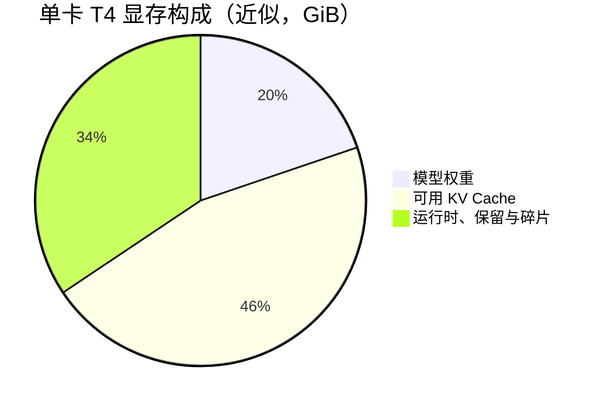
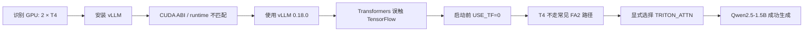

# 单卡 T4 基线：Qwen2.5-1.5B-Instruct

**日期**：2026-09-25  
**目的**：验证 Kaggle T4 环境可稳定运行 vLLM，并建立后续并发压测的对照点。

## 配置

| 类别 | 值 |
| --- | --- |
| 环境 | Kaggle，T4 × 2；本次仅使用 GPU 0 |
| 模型 | `Qwen/Qwen2.5-1.5B-Instruct` |
| vLLM | `0.18.0` |
| dtype | FP16 (`half`) |
| Tensor Parallel | 1 |
| `gpu_memory_utilization` | 0.70 |
| `max_model_len` | 2048 |
| 执行模式 | `enforce_eager=True` |
| Attention | `TRITON_ATTN` |

## 关键观测

| 观测 | 结果 | 正确解读 |
| --- | --- | --- |
| 模型权重 | 约 2.89 GiB | 权重之外还要为运行时和 KV Cache 留空间。 |
| 可用 KV Cache | 6.69 GiB | 并发请求历史状态的共享预算。 |
| 物理 KV 池 | 250,624 tokens | 多请求共享的总 token 容量，不是单请求上限。 |
| 容量/`max_model_len` | 约 122.38× | 固定 2048 token 上限时的理想上界；实际取决于输出长度与调度。 |
| 短生成速度 | 约 16.43 output tok/s | 单请求、短输出的观测值；不是峰值吞吐基准。 |

## 排障路径

| 现象 | 原因 | 本次处理 |
| --- | --- | --- |
| CUDA runtime 库报错 | 包的编译 CUDA 版本与镜像运行时不兼容 | 使用环境可运行的 vLLM 0.18.0。 |
| 导入触发 TensorFlow / OpenSSL 冲突 | Transformers 自动探测到 TensorFlow | 在导入前设置 `USE_TF=0`、`USE_TORCH=1`。 |
| 默认 attention 后端失败 | T4 的计算能力为 7.5，不适合假定 FA2 可用 | 用 `AttentionConfig(TRITON_ATTN)` 作为本环境兼容解。 |

## 结论与边界

这次实验证明了“引擎可用、配置可解释”，但**没有**证明 T4 上的极限吞吐。
`enforce_eager=True` 有利于首轮定位问题，也会影响性能。真正要衡量 vLLM 的收益，
下一轮应固定 prompt 与输出长度，在 1 / 4 / 16 / 32 并发下记录 TTFT、P50/P95、
aggregate output tok/s 与 KV Cache 使用情况。
