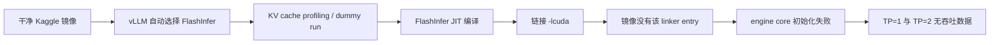

# Kaggle T4 × 2：attention backend 兼容性记录

> 更新（2026-09-27）：Kaggle T4 实测确认，`vllm==0.18.0` 不会消费旧的
> `VLLM_ATTENTION_BACKEND` 环境变量。可复现修复是向 `LLM` 传入
> `attention_config={"backend": AttentionBackendEnum.TRITON_ATTN}`。该结论来自
> 同一 Kaggle 会话中对实际 `LLM` 签名、`AttentionConfig` 与 backend 枚举的检查；修复后
> 仍须完成 TP=1/TP=2 矩阵才能产生吞吐结论。

## 结论

第一次可复现批处理运行没有产生吞吐数字。`vllm==0.18.0` 在 Kaggle 的干净镜像中自动
选择了 FlashInfer；FlashInfer 在 engine warm-up 期间尝试 JIT 编译扩展，但链接器找不到
`-lcuda`。因此 TP=1 和 TP=2 都在 KV-cache profiling 阶段失败，不能把这次运行解读为
模型、显存、调度器或 tensor parallel 的性能结论。



## 原始证据

实验内核的 JSON 产物 `batch_matrix_tp1.json` 和 `batch_matrix_tp2.json` 均记录：

```text
status: failed
error_type: RuntimeError
error: Engine core initialization failed
```

同次 Kaggle 执行日志的根因行是：

```text
RuntimeError: Ninja build failed
/usr/bin/ld: cannot find -lcuda: No such file or directory
```

日志栈显示失败发生在 `flashinfer` 的 `build_and_load()`，上游为 vLLM 启动时的
`profile_cudagraph_memory()`；即发生在可用显存测量期间，而非请求的实际 decode 阶段。

## 修复与验证边界

下一版批处理脚本以 vLLM 0.18 的 typed config 固定 backend：

```python
attention_config={"backend": AttentionBackendEnum.TRITON_ATTN}
```

这不是泛化建议。它只针对当前 Kaggle T4 环境与 `vllm==0.18.0`：本仓库已有单卡基线
验证 `TRITON_ATTN` 可用。修复后仍须重新运行 TP=1/2 的完整 batch 矩阵；在成功 JSON
出现前，不报告任何 TP 加速比或 tok/s。
