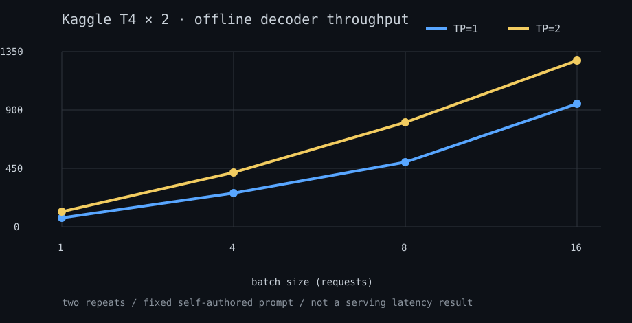
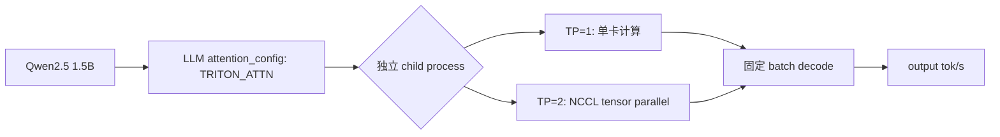

# Kaggle T4 × 2：TP=1 / TP=2 离线 batch 基线

## 结论

在同一 Kaggle T4 × 2 会话、`Qwen/Qwen2.5-1.5B-Instruct`、`vllm==0.18.0`、
FP16、`max_model_len=2048`、`gpu_memory_utilization=0.80` 和 typed
`TRITON_ATTN` 下，TP=2 在四个固定 batch 工作点都快于 TP=1。

| batch | TP=1 output tok/s | TP=2 output tok/s | TP2 / TP1 |
| ---: | ---: | ---: | ---: |
| 1 | 68.084 | 117.291 | 1.723× |
| 4 | 260.912 | 420.756 | 1.613× |
| 8 | 495.084 | 805.488 | 1.627× |
| 16 | 948.685 | **1,283.935** | **1.353×** |

最好的绝对吞吐工作点是 TP=2、batch=16：**1,283.935 output tok/s**。但并行收益从
batch=1 的 1.723× 收敛到 batch=16 的 1.353×，说明在这个小模型和大 batch 下，
通信与并行协调的固定成本开始侵蚀额外 GPU 的收益。它不是“两个 T4 一定翻倍”的证据，
而是下一轮要研究 TP 与 replica 分流边界的实测起点。

## 已验证的运行链路

早期尝试把 `VLLM_ATTENTION_BACKEND=TRITON_ATTN` 放入环境变量；在 vLLM 0.18 中它会被
标为 unknown，因此实际仍选择 FlashInfer，并在 Kaggle 镜像的 `-lcuda` JIT 链接处失败。
本次改为 `attention_config={"backend": AttentionBackendEnum.TRITON_ATTN}`，TP=1 和 TP=2
均成功完成。完整兼容性证据在
[backend compatibility](2026-09-26-kaggle-backend-compatibility.md)。

## 资源证据

| 配置 | model load 后每张可见卡的 free GiB |
| --- | --- |
| TP=1 | 2.159 / 14.460 |
| TP=2 | 1.899 / 1.899 |

TP=1 只实际装载到 GPU 0；TP=2 将模型与 KV budget 分摊到两张 T4。vLLM 引擎日志同时显示
chunked prefill（`max_num_batched_tokens=8192`）、prefix caching 和 CUDA graph 均开启。

## 结果边界与下一步

- 每个 batch 只有两次重复，现阶段适合识别量级和趋势，不足以报告统计显著性。
- 这是固定自编 prompt 的离线 decode 对照；它没有客户端到达过程，**不能**报告 TTFT、TPOT、
  P95 或生产 QPS。
- 下一项实验将使用公开 ShareGPT，只保存 URL/hash/seed、聚合指标、服务配置和 GPU CSV，不
  保存任何原始对话。首轮比较 TP=1、TP=2、并发 1/4/16，并把离线的 TP 曲线与在线 tail latency
  分开解释。

聚合数据在 [measurement JSON](measurements/2026-09-27-kaggle-t4x2-batch-matrix.json)，它不含
原始 prompt、公开数据集对话或模型回复。
